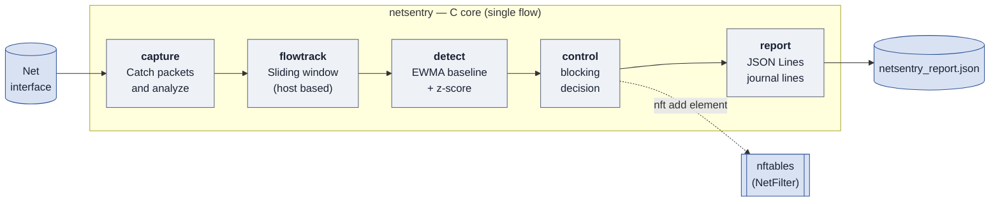

# NetSentry

IoT-based network security monitoring & control system (thesis project).
Single-threaded IDS/IPS engine in C: captures traffic, tracks per-host
behavior in a sliding window, detects anomalies, and (eventually) blocks
offending hosts via nftables.



## Build

```sh
make            # builds ./netsentry
make debug      # builds ./netsentry with debug symbols (verbose logging)
make clean      # removes build/ and the binary
```

## Run

Live packet capture needs raw socket access, so you have two options:

**Option A — just use sudo (simplest, every time):**
```sh
sudo ./netsentry <interface>
```

**Option B — grant the binary capture capability once (no sudo needed after):**
```sh
sudo setcap cap_net_raw,cap_net_admin+eip ./netsentry
./netsentry <interface>
```
Note: `setcap` capabilities are lost every time you rebuild with `make`
(the binary is a new file), so you'll need to re-run the `setcap` line
after each `make`.

### Picking an interface

```sh
ip -o link show          # list available interfaces
```
Common choices:
- `lo` — loopback only, good for local testing (see below)
- `eth0` / `enp0s3` / etc. — your real network interface
- `any` — capture on all interfaces at once

### Stopping

`Ctrl+C` triggers a clean shutdown (`pcap_breakloop` under the hood) —
it will print `capture stopped.` and exit normally rather than being killed.

## Quick test without real network traffic

Loopback traffic is enough to sanity-check the whole pipeline:

```sh
# terminal 1
sudo ./netsentry lo low|medium|high

# terminal 2 — generate some traffic
ping -c 3 127.0.0.1
curl -m 1 http://127.0.0.1:9/     # port 9 is closed -> triggers a TCP SYN + RST
# simulate burst traffic from a single source IP
for i in $(seq 1 200); do ping -c 1 -W 1 127.0.0.1 > /dev/null; done
```

You should see parsed packet lines in terminal 1, including the running
per-source-IP totals (packets/bytes/SYNs) from `flowtrack`.

## Project layout

```
src/
├── netsentry.h   — shared packet_info_t struct
├── capture.h/.c  — libpcap wrapper: opens interface, parses Ethernet/IP/TCP/UDP/ICMP
├── flowtrack.h/.c— per-source-IP sliding-window traffic tracker (hash table + ring buffers)
└── main.c        — wiring: capture loop, periodic tick, signal handling
```

## Status

- [x] Packet capture + parsing (Ethernet/IPv4/TCP/UDP/ICMP)
- [x] Per-host sliding-window stats (packets, bytes, SYN count)
- [x] Anomaly detection (baseline + threshold, `detect.c`)
- [x] Active response via nftables (`control.c`)
- [x] Alert/report output for the dashboard prototype
- [x] Dashboard prototype (HTML/JS served by a simple HTTP server)
